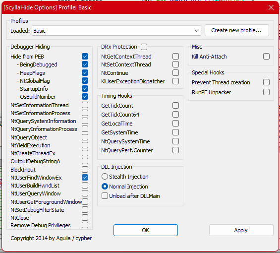

# Corch-Crackme - competition crackme v1.0 by corch#2222

 >[Download from Crackmes.one](https://crackmes.one/crackme/62b6efd133c5d4251e7239c2)

After unzipping rar we get one .exe file named "Crackme.exe". when we run that file it asks us a password. 
in crackmess one description author state that we can patch it or find password. 

first we can check it with pe scanning tool to get a idea , i'm using Detect It Easy 

Looks like it is not packed. 

## Load it up with a debugger

without any anti-anti-debug plugins enabled , it show a message in console "You have been detected !". lets find out how they detect the debugger

- looking at import address table we can see there are some Win32 API's that can detect a debugger. by searching all intermodular calls in exe , we can see where these apis get called. 
    - IsDebuggerPresent
    - FindWindowA
    

we can simply use ScyllaHide pluging to bypass these anti-debug tricks. 

